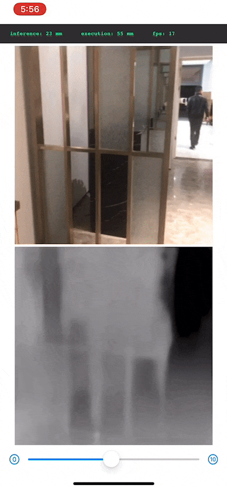

# FastDepth-CoreML
This is a CoreML version of [FastDepth: Fast Monocular Depth Estimation on Embedded Systems](https://github.com/dwofk/fast-depth). I do not guarantee the correctness of my conversion.  
The iOS project is based on tucan9389's [DepthPrediction](https://github.com/tucan9389/DepthPrediction-CoreML), but with [CoreMLHelpers](https://github.com/hollance/CoreMLHelpers/) for convenience.

# Example
Recorded on an iPhone X.  
